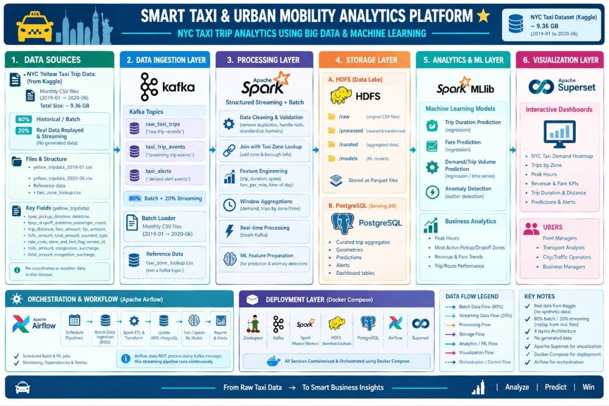

# NYC Smart Taxi - Big Data Engineering Pipeline

An end-to-end Big Data & Analytics platform processing large-scale NYC Yellow Taxi trip records (~101M raw records / ~98.6M curated records) using distributed batch processing, real-time streaming ingestion, machine learning, and interactive business intelligence dashboards.

## Architecture & Pipeline
- **Distributed Storage:** Apache Hadoop HDFS
- **Batch Processing:** Apache Spark (PySpark Data Cleansing & Aggregations)
- **Streaming Ingestion:** Apache Kafka & Spark Structured Streaming
- **Machine Learning:** Spark MLlib (Fare, Duration, Demand, & Anomaly models)
- **Pipeline Orchestration:** Apache Airflow
- **Serving Layer:** PostgreSQL (JDBC Data Warehouse)
- **BI & Visualization:** Apache Superset
- **CI/CD & Automation:** GitHub Actions (Code Quality & DAG Validation)

## Project Structure
```text
nyp-taki/
├── .github/workflows/   # CI/CD pipeline automation
├── airflow/             # DAG definitions and pipeline orchestration
├── dashboards/          # Superset dashboard exports and configs
├── docker/              # Docker Compose environment setup
├── kafka/               # Kafka streaming producer
├── postgres/            # Database schema & init scripts
├── spark/
│   ├── batch/           # Batch ETL and aggregation jobs
│   ├── mllib/           # ML models (fare, duration, demand, anomaly)
│   └── stream/          # Spark Structured Streaming consumer
├── .gitignore
└── README.md